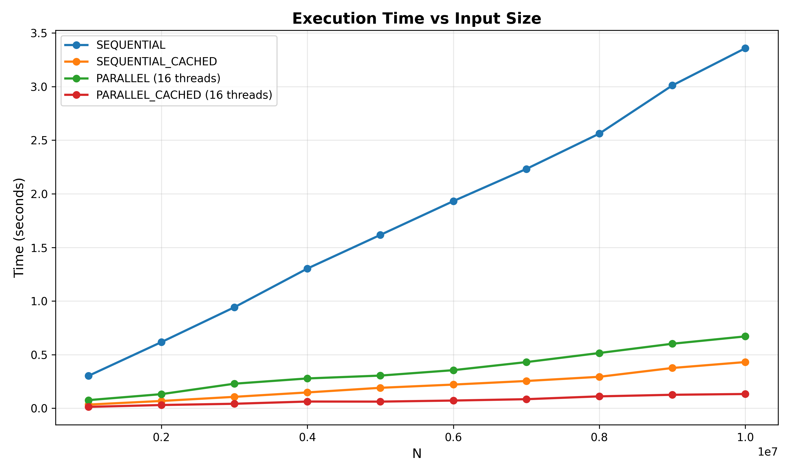
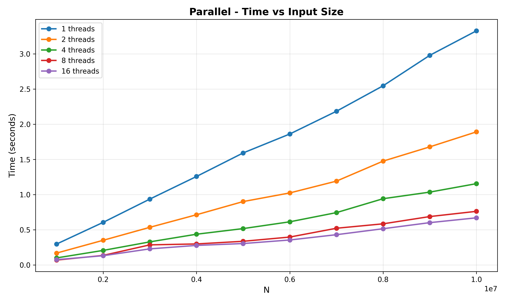
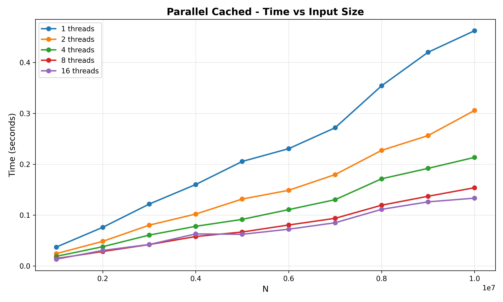
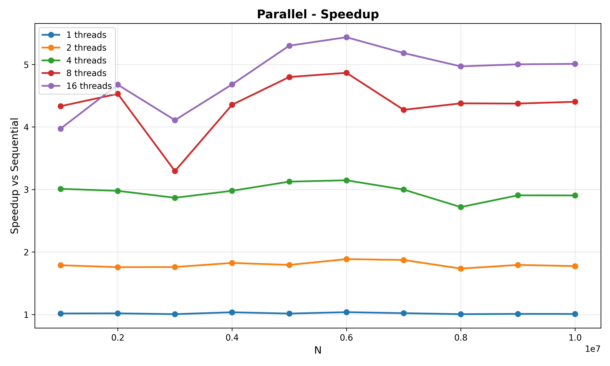
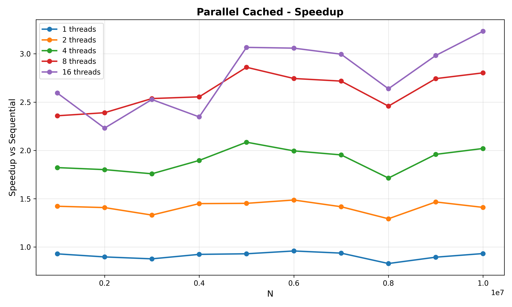

# 19. Любое число $n$, большее единицы, порождает последовательность вида

$$n_{i+1} =
\begin{cases}
n_i / 2  & \text{if } n\equiv 0 \pmod {2},\\
3n_i + 1 & \text{if } n\equiv 1 \pmod {2}.
\end{cases}
$$

последним элементом которой является 1 (например: $13 \rightarrow 40 \rightarrow 20 \rightarrow 10 \rightarrow 5 \rightarrow 16 \rightarrow 8 \rightarrow 4 \rightarrow 2 \rightarrow 1$). Найти наибольшее, меньшее заданного $N$, число, порождающее самую длинную такую последовательность.

## Сборка

### Конфигурация

```bash
cmake \
  -S . \
  -B $BUILD_DIR \
  -DCMAKE_BUILD_TYPE=$BUILD_TYPE \
  -DCMAKE_C_COMPILER=$CC \
  -DSANITIZER=$SANITIZER
```

### Компиляция

```bash
cmake --build $BUILD_DIR --target all -j$(nproc)
```

### Простейшая сборка

```bash
cmake -S . -B build -DCMAKE_BUILD_TYPE=Release

cmake --build build --target all -j$(nproc)
```

## Запуск

```bash
$BUILD_DIR/mirp-lab-2 --help
```

```text
Usage: ./cmake-build-debug-clang/mirp-lab-2 [options] <N>

N                                   target value
Options:
    -t, --trace, --trace=<TRACE>    select trace level (none, result, all), default none
    -r, --run                       select running method (sequential, sequential_cached, parallel, parallel_cached), default all
    -h, -u, --help, --usage         display this message
    -v, --version                   display version
```

### Запуск всех методов без трейсинга

```bash
./build/mirp-lab-2 --trace=none 1000000
```

### Запуск всех методов с выводом самой длинной последовательности

```bash
./build/mirp-lab-2 --trace 1000000
```

### Запуск всех методов с выводом всех последовательностей и самой длинной последовательности

```bash
./build/mirp-lab-2 --trace=all 1000000
```

## Анализ результатов

### Сравнение производительности всех методов



График показывает зависимость времени выполнения от размера входных данных N для всех четырех методов. Из графика видно значительное ускорение при распараллеливании, при этом `cached`-версия все еще быстрее параллельной.

### Масштабируемость параллельного метода



График показывает, как время выполнения алгоритма PARALLEL зависит от числа потоков для разных значений N. Видна хорошая масштабируемость: с увеличением потоков время снижается, особенно до 8 потоков, дальше эффект слабее (обуславливается накладными расходами многопоточности и фоновыми процессами системы).

### Масштабируемость параллельного метода с кешем



Аналогично для кешированной версии.

### Ускорение параллельного метода



График показывает, во сколько раз параллельная версия быстрее последовательной. Видно, что:

- Максимальное ускорение достигается на 16 потоках
- На большем числе потоков рост замедляется из-за накладных расходов многопоточности и влияния фоновых процессов системы

#### Ускорение параллельного метода с кешем



График ускорения для кешированной версии выглядит аналогично, можно отметить, что из-за меньшего числа вычислений, а значит большего влияния накладных расходов многопоточности, рост ускорения значительно меньше, как и само ускорение.
